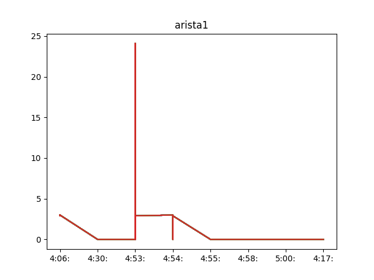
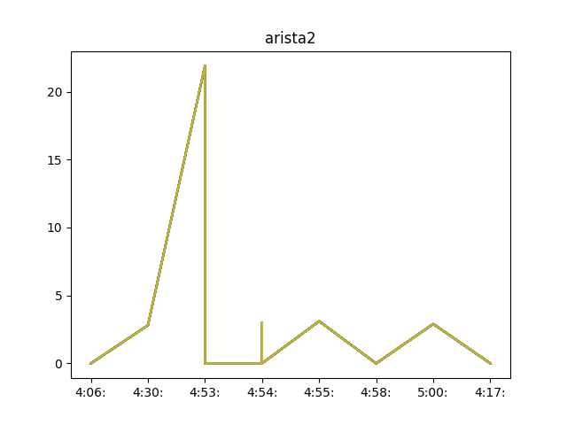
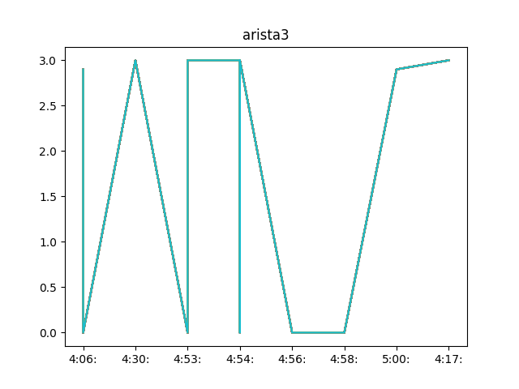

# CPU Utilization Collector for Network Devices


---

## 📖 Description
This project automates the process of collecting CPU utilization data from network devices via SSH. It validates IP addresses, checks device reachability, connects using SSH, collects CPU metrics, and plots animated graphs of CPU usage over time.

## 🚀 Features
- IP file validation and IP address validation
- Device reachability check
- SSH connection and command execution
- CPU utilization data extraction and JSON storage
- Animated CPU utilization graphs using Matplotlib
- Multithreaded device connections for efficiency

## 🛠️ Tech Stack
- Python 3.x
- Paramiko (SSH Library)
- Matplotlib
- JSON
- Threading

## 📦 Project Structure
```
src/
├── Core scripts: Connection, Validation, Threading, Graph plotting
data/
├── Static data: IP addresses, CPU data, credentials, commands
```

## 📥 Installation
```bash
# Clone the repository
git clone https://github.com/your-username/cpu-utilization-collector.git

# Navigate into the directory
cd cpu-utilization-collector

# Install dependencies
pip install paramiko matplotlib
```

## 🏃‍♂️ Usage
1. Prepare:
   - A file containing IP addresses (`ips.txt`) under the `data/` directory.
   - A credentials file (`credentials.txt`) with `username,password`.
   - A command file (`cmd.txt`) containing device-specific commands to collect CPU stats.
2. Run:
   ```bash
   cd src
   python app.py
   ```

## 📸 Screenshots

Here are real-time CPU utilization graphs captured from three Arista switches:

### Arista 1


### Arista 2


### Arista 3


These plots visualize CPU usage over time and are updated live based on device monitoring.

## 🙌 Contributing
Contributions are welcome!  
Please fork the repo and submit a pull request.

## 📝 License
Distributed under the MIT License. See `LICENSE` for more information.
